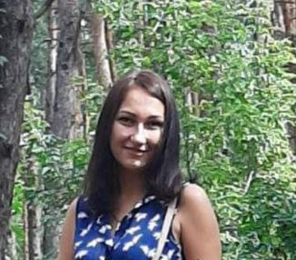

# Inna Didenko

## Contacts
* +38-097-876-17-97
* innadidenko29@gmail.com

## About Me
 I am a switcher and I am changing my life and field of activity to
 web development. This work brings me personal satisfaction. I like
 to work and see the results of my work. In the future, I would like
 to work in a large company and be part of a big project.

## Education
*  Rs School - December 2022 - up to now
*  Weekly marathon in OktenSchool - October 2022
*  Weekly marathon in Byte Education - September 2022

## Skils
* html5
* css3
* figma
* git

## Projects
1.  https://melodious-kleicha-c1c7e9.netlify.app"
2.  https://inna38.github.io/project/

## Languages
* English [A2]
* Ukrainian [Native]
* Russian [Proficiency]

### My Github 2022 
https://github.com/Inna38

### Rolling-scopes-school
https://github.com/rolling-scopes-school/tasks
